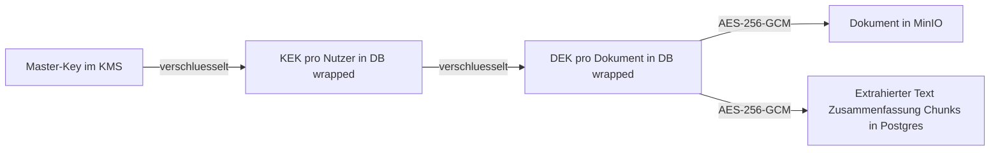

# 03 — Security-Konzept

## 1. Schutzziele

1. **Vertraulichkeit**: Dokumente und daraus abgeleitete Inhalte (Text, Zusammenfassungen) sind
   für niemanden außer den berechtigten Nutzern lesbar — auch nicht für Betreiber-Admins,
   Datenbank- oder Storage-Zugriffe.
2. **Datensouveränität**: Keine Nutzerdaten verlassen die eigene Infrastruktur; keine externen
   KI-APIs (kein OpenAI/Gemini/etc.).
3. **Isolation**: Nutzer A kann unter keinen Umständen (auch nicht via Chat/RAG) Inhalte von
   Nutzer B erhalten, sofern nicht explizit geteilt.
4. **Kostenkontrolle**: Keine KI-Operation ohne Credit-Deckung und (konfigurierbare) Zustimmung.

## 2. Envelope-Verschlüsselung

- **DEK** (Data Encryption Key): 256-bit-Zufallsschlüssel pro Dokument. Verschlüsselt das
  Originalobjekt in MinIO sowie alle abgeleiteten Klartexte in Postgres (extrahierter Text,
  Zusammenfassung, Handlungsempfehlung, Chunk-Texte). AES-256-GCM mit zufälliger Nonce pro Feld.
- **KEK** (Key Encryption Key): 256-bit-Schlüssel pro Nutzer, erzeugt bei der Provisionierung.
  Liegt nur „wrapped" (mit Master-Key verschlüsselt) in der DB.
- **Master-Key**: liegt ausschließlich im KMS-Layer (`app/crypto/kms.py`).
  - Lokal/MVP: 256-bit-Key aus der Umgebungsvariable `DOCU9_MASTER_KEY` (vom Setup-Skript erzeugt,
    nie im Repo).
  - Produktion: HashiCorp Vault Transit / Cloud-KMS / HSM. Das `Kms`-Interface (`wrap`/`unwrap`)
    ist dafür vorbereitet; Support-/Admin-Rollen erhalten keine KMS-Policy.

**Warum kein Klartext-Leak möglich ist**: DB-Dump + MinIO-Dump ohne Master-Key ergeben
ausschließlich Ciphertext. Der Klartext existiert nur transient im Speicher von `api`
(Download/Export/Chat-Kontext) und `worker` (Pipeline) — nie auf Platte, nie in Logs.

**Bewusste Ausnahmen (dokumentierte Restrisiken)**:

| Daten | Klartext? | Begründung |
|---|---|---|
| Embeddings (pgvector) | ja (Vektoren) | Vektorsuche erfordert Rechenbarkeit; Rekonstruktion von Text aus Embeddings ist nur approximativ möglich. Chunk-Klartexte sind verschlüsselt. |
| Metadaten (Titel, Dokumenttyp, Absender, Tags, Fristen, Beträge) | ja | Nötig für Listen, Filter, Fristen-Radar, Smart Collections ohne Entschlüsselungs-Roundtrip. Enthalten keine Dokumentvolltexte. Härtung (Verschlüsselung + verschlüsselter Index) auf der Roadmap. |
| E-Mail-Adresse, Anzeigename | ja | Betrieb/Support/Login. |

## 3. Authentifizierung & Autorisierung

- **AuthN**: Keycloak (OIDC Authorization Code Flow + PKCE via NextAuth). Registrierung per
  E-Mail (Verifikation über SMTP), Social Login (Google/Apple/Meta) als Keycloak Identity
  Provider konfigurierbar. **MFA**: TOTP in Keycloak als optionale Aktion — beworben und
  empfohlen, nicht erzwungen.
- **Token-Validierung**: API validiert RS256-JWTs gegen das Realm-JWKS (Issuer- und
  Audience-Check, Clock-Skew-Toleranz).
- **AuthZ**: Jede Query ist Space-gebunden. Dokumente: sichtbar für den Besitzer sowie — bei
  `visibility = shared` — für alle Mitglieder des Space. Kein Endpoint gibt Objekte außerhalb
  des eigenen Space zurück (durchgängig per SQL-Filter erzwungen, nicht per Nachfilterung).

## 4. LLM-Firewall

Alle LLM-Interaktionen laufen durch `app/llm/firewall.py`:

1. **Kontext-Isolation (hart, DB-Ebene)**: RAG-Suche joint auf die Sichtbarkeitsregeln des
   anfragenden Nutzers. Fremde Chunks können den Prompt physisch nicht erreichen.
2. **Input-Sanitisierung**: Kontrollzeichen entfernen, Länge begrenzen, Injection-Heuristiken
   (u.a. „ignore previous instructions", „system prompt", Rollen-Umdefinition, jailbreak-Muster
   in de/en). Treffer werden geflaggt und im Ergebnis ausgewiesen.
3. **Delimiter-Prompting**: Dokumentinhalte werden in eindeutige Delimiter gekapselt mit der
   Systemanweisung, Inhalte ausschließlich als Daten zu behandeln.
4. **Output-Validierung**: Analyse-Antworten müssen dem JSON-Schema entsprechen (Pydantic);
   Chat-Antworten werden auf System-Prompt-Leakage geprüft.
5. **Rate-Limiting über Credits**: Ohne Deckung kein LLM-Call — begrenzt Missbrauch strukturell.

Roadmap: zusätzlicher Injection-Klassifikator (z.B. Prompt-Guard-Modell) vor Schritt 3.

## 5. Bedrohungsmodell (Auszug)

| Bedrohung | Gegenmaßnahme |
|---|---|
| Admin/Insider liest Dokumente | Envelope-Verschlüsselung; Master-Key nur im KMS; Support-UI arbeitet ausschließlich auf Metadaten |
| DB-/Storage-Leak | Nur Ciphertext verwertbar |
| Prompt Injection über Dokumentinhalt | Firewall Schritte 2–4 |
| Cross-User-Datenabfluss via Chat | Kontext-Isolation auf DB-Ebene |
| Kostenexplosion (z.B. E-Mail-Bombing in Phase 2) | Vorrat ohne Auto-Verarbeitung, Kostenschätzung + Bestätigung/Schwellwert, Credits |
| Gestohlene Session | Kurzlebige Access-Tokens (5 min), Refresh-Rotation in Keycloak, MFA empfohlen |
| Malware-Upload | MIME-/Größen-Whitelist (PDF, JPEG, PNG, TIFF, HEIC; max. 50 MB); Dokumente werden nie ausgeführt, nur geparst; Parser laufen im Worker-Container ohne Netzwerk-Egress-Bedarf (Roadmap: Sandbox) |

## 6. DSGVO

- **Rechtsgrundlage Verarbeitung**: Vertragserfüllung (Art. 6 Abs. 1 lit. b); Trainings-Opt-in:
  Einwilligung (Art. 6 Abs. 1 lit. a), jederzeit widerrufbar.
- **Trainingsdaten / Privacy-Gate**: Kein Dokument-Freitext im Clean-Store oder in der globalen
  Beispiel-Bank. Jedes Sample durchläuft fail-closed Detektoren (E-Mail, IBAN, Telefon, Adresse,
  PLZ/Ort, lange Ziffern, Referenznummern, URLs, Geburtsdaten, personenähnliche Namen, bekannte
  Space-Entitäten). Gespeichert werden nur Feature-Snippets + Allowlist-Labels. Globale Nutzung
  erst nach k-Anonymität (k=5 Spaces). Rejected-Samples speichern nur den Ablehnungsgrund.
  Admin sieht ausschließlich die Clean-Bank (kein Quarantäne-Klartext). `space_id` nur an
  Clean/Reject-Samples und Pattern-Hits für Löschkaskaden — nie in der Bank. Widerruf stoppt
  neue Sammlung und löscht Space-Hits; bereits globale Einträge bleiben (Consent-Text).
- **Löschung**: Account-Löschung → Krypto-Shredding (KEK löschen genügt, alle DEKs werden
  unbrauchbar) + physisches Löschen der Objekte/Zeilen + Trainingsdaten des Space.
- **Auskunft/Export**: Smart-Collection-Export liefert alle Dokumente + Metadaten als ZIP.
