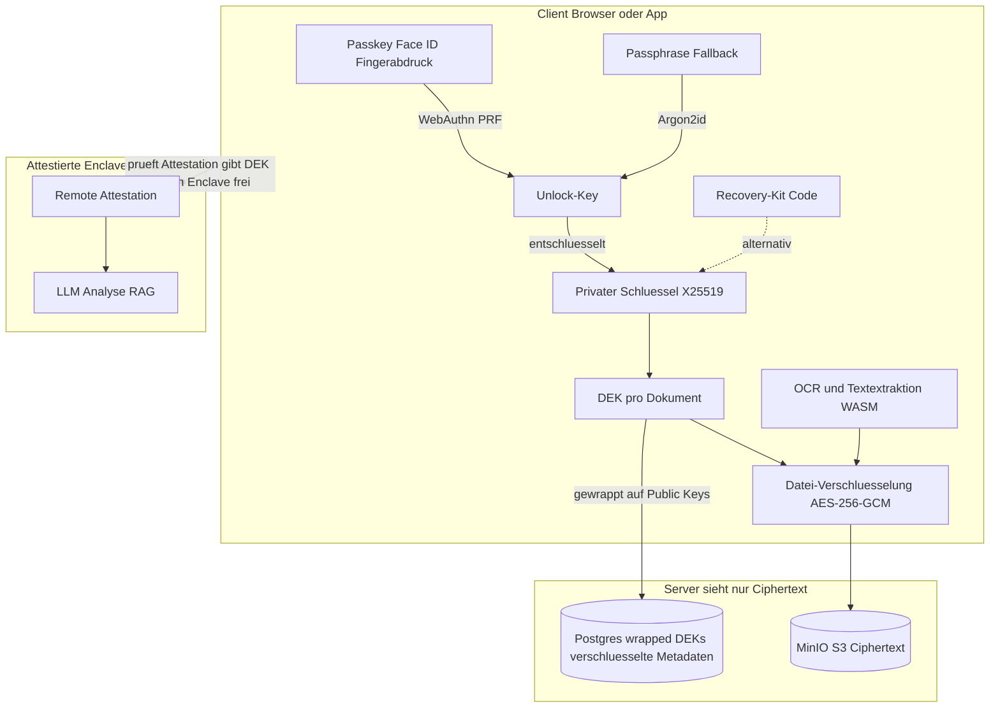

# 07 — Zero-Knowledge-Verschlüsselungskonzept

Status: **Konzept ausgearbeitet** (siehe ADR-14 in [02-adrs.md](02-adrs.md) und
Roadmap-Pakete ZK1–ZK4 in [06-roadmap.md](06-roadmap.md)). Beschlossene erste Schritte
(Sicherheits-Runde Juli 2026): **Betriebs-Härtung des Envelope-Modells** (Paket AA:
Vault-KMS, Entschlüsselungs-Audit-Log, verschlüsselte Backups) und der **Private Tresor**
(Paket AB) als „ZK1-light" — clientseitige Verschlüsselung für markierte Dokumente mit
Passkey-first-Unlock, KI nur per aktiver Sitzungs-Freigabe. ZK2–ZK4 bleiben bewusst
unumgesetzte Optionen.

Dieses Dokument beantwortet die Frage: *Können wir die Funktionen von docu9 erhalten und
gleichzeitig kryptografisch sicherstellen, dass weder ein korrumpierter Betreiber noch ein
Angreifer mit vollem Server-Zugriff Dokumente anderer Nutzer entschlüsseln kann?*

## 1. Befund: Warum das heutige Konzept diese Anforderung nicht erfüllt

Das aktuelle Modell (ADR-09, [03-security.md](03-security.md)) ist eine reine
**Serverseiten-Verschlüsselung** mit Envelope-Hierarchie:

- Der Master-Key liegt beim Betreiber (`DOCU9_MASTER_KEY`, in Produktion Vault/HSM). Wer ihn
  besitzt — der Betreiber selbst oder ein Angreifer mit Zugriff auf die Server-Umgebung —
  kann jeden User-KEK und damit **jedes Dokument** entschlüsseln.
- Der Client lädt Klartext hoch (`UploadDropzone` → `POST /documents`) und erhält Klartext
  zurück (`GET /documents/{id}/file`); sämtliche Kryptografie passiert in API und Worker
  (`backend/app/crypto/envelope.py`).
- Embeddings (pgvector), Metadaten (Titel, Absender, Fristen, Verträge) und Chat-Verläufe
  liegen **unverschlüsselt** in Postgres.
- Das Keycloak-Passwort schützt nur den API-Zugang; es gibt keine kryptografische Bindung
  der Schlüssel an den Nutzer.

**Fazit:** Schutz gegen DB-/Storage-Dumps und beiläufigen Admin-Zugriff: ja. Schutz gegen
korrupten Betreiber oder vollständige Server-Kompromittierung: nein — per Design (ADR-09).

## 2. Ehrliche Einordnung der 100%-Frage

- **Unverändert alle Funktionen + absolute Garantie = unmöglich.** OCR, LLM-Analyse und
  RAG-Chat benötigen Klartext. Überall, wo der Server Klartext sieht, kann ein vollständig
  korrumpierter Server ihn abgreifen. Das ist keine Implementierungsschwäche, sondern
  Informationstheorie.
- **Erreichbar ist** die Garantie: *„Kompromittierung von Betreiber, Datenbank, Storage und
  Backend-Code — einzeln oder zusammen — führt niemals zu Klartext."* Dafür müssen die
  Schlüssel den Client nie unverschlüsselt verlassen, und Verarbeitung muss entweder
  clientseitig oder in vom Client attestierten Enclaves stattfinden.
- **Prinzipbedingte Restrisiken** (gelten für jedes System dieser Art, auch Proton oder
  Tresorit):
  1. Kompromittiertes **Endgerät** des Nutzers — außerhalb jedes Server-Schutzmodells.
  2. Bei Web-Auslieferung: der Betreiber könnte **manipulierten Frontend-Code** ausliefern,
     der Schlüssel exfiltriert. Mitigierbar durch reproduzierbare signierte Builds,
     Transparenz-Log und optional native Apps (Abschnitt 3.6) — nicht durch Kryptografie allein.
  3. Bei der TEE-Variante: **Hardware-Seitenkanäle** gegen die Enclave (klein, nicht null).

## 3. Ziel-Architektur

### 3.1 Schlüsselhierarchie (Client-Hoheit) — Passkey-first

Kern: Pro Nutzer ein zufälliges **X25519-Schlüsselpaar**, erzeugt auf dem Gerät
(WebCrypto/libsodium). Der private Schlüssel liegt nur **verschlüsselt** („gewrappt") in der
DB — der Server sieht ausschließlich Public Key + unlesbare Key-Blobs. Für das Entsperren
gibt es mehrere parallele Wraps, geordnet nach Komfort:

1. **Passkey (primärer Weg — Login und Entschlüsselung in einer Geste).** Passkeys mit der
   **WebAuthn-PRF-Extension** liefern neben der Authentifizierung ein gerätegebundenes
   Geheimnis, das nur der Authenticator (Secure Enclave, iCloud-Schlüsselbund,
   Android-Keystore, Hardware-Key) kennt. Daraus leitet der Client den Unlock-Key ab und
   entschlüsselt den privaten Schlüssel — **derselbe Face-ID-/Fingerabdruck-Moment
   erledigt Login und Vault-Entsperrung**, ohne dass der Nutzer sich irgendetwas merken
   muss und ohne dass der Server je etwas Verwertbares sieht. Jeder registrierte Passkey
   (Handy, Laptop, Hardware-Key) erhält seinen eigenen Wrap des privaten Schlüssels;
   Geräte lassen sich einzeln hinzufügen und entziehen. Da Passkeys über
   iCloud-Schlüsselbund bzw. Google Password Manager synchronisieren, ist auch der
   Gerätewechsel innerhalb eines Ökosystems komfortabel.
2. **Passphrase (Fallback).** Für Browser/Authenticatoren ohne PRF-Unterstützung: Wrap
   unter einem per **Argon2id** aus einer Passphrase abgeleiteten Schlüssel. Die Passphrase
   verlässt das Gerät nie (das Keycloak-Login-Passwort ist dafür ungeeignet, da es beim
   Server-Login im Klartext geprüft wird — es bleibt reine Zugangskontrolle).
3. **Recovery-Kit.** 24-Wörter-Code bzw. druckbares PDF als unabhängiger Not-Wrap;
   optional Shamir-Sharing über Vertrauenspersonen (fügt sich in das Notfallkit-Konzept
   aus Paket U ein).
4. **Optionaler Betreiber-Recovery-Key** (Opt-in, jederzeit widerrufbar) — Abschnitt 3.2.

Ohne Opt-in aus Punkt 4 gilt: **Kein Betreiber-Escrow** — Verlust *aller* eigenen Faktoren
(alle Passkeys, Passphrase und Recovery-Kit) bedeutet unwiederbringlichen Datenverlust.
Das ist der Preis der maximalen Garantie und muss im UI unmissverständlich kommuniziert
werden; das Passkey-first-Design macht diesen Fall aber unwahrscheinlich, weil typische
Nutzer mehrere synchronisierte Passkeys besitzen.

Dokument-Ebene: Pro Dokument ein **DEK** (wie heute AES-256-GCM), aber **clientseitig
erzeugt** und auf die Public Keys aller Berechtigten gewrappt (Owner, Familienmitglieder
mit Zugriff).

- **Sharing** = zusätzlicher DEK-Wrap auf den Public Key des Mitglieds — kein Re-Encrypt
  der Datei.
- **Passkey-/Passphrase-Wechsel** = Re-Wrap nur des privaten Schlüssels — keine
  Datenmigration.
- **Krypto-Shredding** funktioniert weiter: Löschen der Key-Blobs macht alle DEKs
  unbrauchbar — jetzt sogar ohne Vertrauen in den Betreiber.

### 3.2 Optionaler Betreiber-Recovery-Key (Opt-in, widerrufbar)

Für Nutzer, denen Komfort und ein Sicherheitsnetz wichtiger sind als die maximale
Garantie, gibt es eine **freiwillige Wiederherstellungs-Option** — wählbar bei der
Registrierung oder jederzeit später in den Einstellungen:

- **Anlegen:** Der Client wrappt den privaten Schlüssel des Nutzers zusätzlich auf einen
  dedizierten **Recovery-Public-Key des Betreibers** (eigenes Keypair, privater Teil
  ausschließlich in Vault/HSM mit strenger Zugriffs-Policy und Audit-Log; getrennt vom
  Prüf-Schlüssel aus Abschnitt 3.4). Beim Betreiber liegt damit nur ein **verschlüsseltes
  Blob** (`operator_recovery_wrapped_key`), das ohne den HSM-Schlüssel wertlos ist.
- **Nutzung:** Verliert der Nutzer alle eigenen Faktoren, kann der Betreiber nach einem
  definierten Identitätsnachweis (z.B. Video-Ident/PostIdent-Niveau, nicht bloß E-Mail)
  das Blob im HSM entschlüsseln und dem Nutzer den Zugang wiederherstellen. Jede Nutzung
  wird dem Nutzer angekündigt (Warteschleife mit Veto, analog Paket U) und im
  nutzer-sichtbaren Audit-Log protokolliert.
- **Widerruf:** Jederzeit in den Einstellungen. Der Client löscht das Blob und **rotiert
  zusätzlich das Schlüsselpaar** (neues X25519-Paar, alle DEK-Wraps werden auf den neuen
  Public Key umgeschrieben — reine Key-Wrap-Operation, kein Re-Encrypt der Dateien).
  Dadurch ist der Widerruf auch dann wirksam, wenn ein bösartiger Betreiber das alte Blob
  heimlich kopiert hätte.
- **Ehrliche Einordnung:** Mit hinterlegtem Recovery-Key **kann** der Betreiber (bzw. wer
  Vault/HSM *und* DB gleichzeitig kompromittiert) dieses eine Konto technisch
  entschlüsseln — die Zero-Knowledge-Garantie gilt für dieses Konto nur noch
  organisatorisch abgesichert (HSM-Policy, Vier-Augen-Prinzip, Audit), nicht mehr
  kryptografisch absolut. Das UI zeigt den Status dauerhaft transparent an
  („Wiederherstellung durch Betreiber: aktiviert/deaktiviert") und erklärt den Trade-off
  bei der Aktivierung. Standard ist **aus**.

Damit deckt das Konzept das ganze Spektrum ab: maximale Garantie ohne Netz (nur eigene
Faktoren), Komfort mit Netz (Betreiber-Recovery, widerrufbar) — die Entscheidung liegt
immer beim Nutzer und ist reversibel.

### 3.3 Funktionserhalt im Einzelnen

| Funktion | Zero-Knowledge-Umsetzung | Einschränkung |
|---|---|---|
| Upload/Download/Vorschau | Ver-/Entschlüsselung im Browser (Streaming) | keine |
| OCR/Textextraktion | Client beim Upload (pdf.js + tesseract.js/WASM) | OCR-Qualität bei Fotos ggf. leicht unter Server-Tesseract |
| KI-Analyse, RAG-Chat, Antwort-Assistent | Variante A (Enclave) oder B (Client) — siehe unten | A: TEE-Restrisiko; B: Modellqualität |
| Embeddings/Vektorsuche | verschlüsselt gespeichert; Suche in Enclave (A) oder clientseitig (B) | pgvector-Klartextsuche entfällt |
| Fristen-Radar, Vertrags-Cockpit, Listen | Analyse-Ergebnis wird verschlüsselt gespeichert, clientseitig entschlüsselt und gerendert | minimales Klartext-Feld für Server-Erinnerungen (nur Fälligkeitsdatum) |
| E-Mail-Ingest | Sofort-Verschlüsselung auf den Public Key des Nutzers | Empfangsmoment bleibt exponiert |
| Moderation (Paket N) | Prüfung dort, wo die Analyse läuft (Enclave/Client); Betreiber sieht nur Flag + Kategorie; Klärung per **nutzer-initiierter Offenlegung** (Abschnitt 3.4) | ohne Freigabe des Nutzers kein Klartext für den Betreiber |

**KI-Analyse und RAG-Chat — zwei Varianten:**

- **Variante A (empfohlen): Confidential Computing.** Der Worker läuft in einer Enclave
  (AMD SEV-SNP / Intel TDX / AWS Nitro Enclave). Der Client prüft die **Remote Attestation**
  (Measurement des signierten, reproduzierbar gebauten Worker-Images) und gibt den DEK
  ausschließlich verschlüsselt an den attestierten Enclave-Key frei — pro
  Verarbeitungsvorgang, nie persistent. Der Betreiber kann weder in die Enclave hineinsehen
  noch unbemerkt anderen Code unterschieben (anderes Measurement ⇒ Client verweigert die
  Key-Freigabe). Alle heutigen Features bleiben 1:1 erhalten. Restrisiko: TEE-Seitenkanäle.
- **Variante B: Client-seitig.** Kleine Modelle im Browser/lokal für Klassifikation und
  Fristen-Extraktion; RAG über einen clientseitig entschlüsselten Embedding-Index (bei
  privaten Archiven mit tausenden Dokumenten praktikabel — wenige MB). Volle Garantie
  gegenüber dem Server, aber Qualitätsverlust der Analyse gegenüber dem Server-LLM.
- **Pragmatisch:** A als Standard, B als „Paranoid-Modus" pro Nutzer wählbar.

**Metadaten (Fristen-Radar, Vertrags-Cockpit, Suche):** Das Analyse-Ergebnis wird an den
Client (bzw. aus der Enclave verschlüsselt an den Client) zurückgegeben und **clientseitig
verschlüsselt** gespeichert. Für serverseitige Sortierung und Erinnerungs-Mails bleibt ein
minimales Klartext-Feld nötig (z.B. nur das Fälligkeitsdatum ohne jeden Kontext) — eine
bewusste, dokumentierte Ausnahme. Alternative: E-Mail-Erinnerungen über clientseitig
vorberechnete, verschlüsselte Trigger.

**E-Mail-Ingest** (`backend/app/ingest/smtp_server.py`) ist prinzipbedingt nicht
Zero-Knowledge — die Mail kommt im Klartext an. Lösung: Der Empfangs-Service verschlüsselt
Anhänge **sofort asymmetrisch auf den Public Key** des Nutzers (kein Serverschlüssel
beteiligt); danach kann auch der Betreiber nicht mehr entschlüsseln. Nur der Moment des
Empfangs bleibt exponiert — im UI als Einschränkung dieses Ingest-Wegs kennzeichnen.

### 3.4 Moderation & nutzer-initiierte Offenlegung (Streitfall-Klärung)

Die Dokument-Moderation (Paket N: eindeutige Richtlinien-Verstöße ⇒ Status `rejected` +
Credit-Erstattung) bleibt im Zero-Knowledge-Modus erhalten — sie läuft dort, wo die Analyse
läuft: in der attestierten Enclave (Variante A) bzw. im Client (Variante B). Der Betreiber
erhält dabei **nur das Moderations-Ergebnis** (Flag, Kategorie, Konfidenz), nie den Inhalt.

Für die **Klärung eines Moderationsfalls** braucht der Betreiber Klartext — im
Zero-Knowledge-Modus kann er den aber per Design nicht selbst beschaffen. Deshalb gibt es
eine **nutzer-initiierte Offenlegung**, die die Garantie nicht aufweicht:

- Der Betreiber veröffentlicht einen dedizierten **Prüf-Schlüssel** (Review-Keypair,
  privater Teil in Vault/HSM, getrennt von allem anderen; Public Key im Client gepinnt und
  im Transparenz-Log verankert).
- Wird ein Dokument als Verstoß markiert und **möchte der Nutzer den Fall klären**, löst er
  im UI explizit „Zur Prüfung freigeben" aus. Erst dann wrappt sein Client den DEK **genau
  dieses einen Dokuments** zusätzlich auf den Prüf-Schlüssel (`review_wrapped_dek`).
  Optional mit Ablaufdatum: Nach Abschluss des Falls löscht der Server den Wrap; der
  Betreiber verpflichtet sich, entschlüsselte Kopien nicht aufzubewahren.
- **Ohne diese Freigabe bleibt das Dokument für den Betreiber unentschlüsselbar** — auch bei
  einem Verstoß. Die Konsequenz trägt dann der Nutzer: Der Fall kann nicht geprüft werden,
  das Dokument bleibt `rejected` (und je nach Richtlinie ggf. das Konto eingeschränkt). Die
  Wahl liegt vollständig beim Nutzer; es gibt keinen technischen Pfad, der sie umgeht.
- Jede Freigabe und jeder Zugriff darauf wird in einem **für den Nutzer sichtbaren
  Audit-Log** protokolliert (analog zum Notfallzugriffs-Log aus Paket U). Ehrlicher Hinweis
  im UI: Eine einmal offengelegte Datei kann technisch nicht „zurückgeholt" werden.

Damit gilt weiterhin: Der Betreiber allein — korrumpiert oder kompromittiert — kann nichts
entschlüsseln. Klartext entsteht ausschließlich durch eine bewusste, protokollierte,
dokumentbezogene Entscheidung des Eigentümers.

### 3.5 Was am Bedrohungsmodell besser wird

| Bedrohung | Heute (ADR-09) | Zero-Knowledge-Modus |
|---|---|---|
| DB-/Storage-Dump | geschützt (Ciphertext) | geschützt |
| Admin/Insider liest Dokumente | organisatorisch verhindert (Key-Separation) | **kryptografisch unmöglich** |
| Betreiber wird korrumpiert/erpresst | Master-Key ⇒ Vollzugriff | kein verwertbarer Schlüssel vorhanden |
| Server vollständig kompromittiert | Angreifer erlangt Master-Key | Ciphertext + verschlüsselte Key-Blobs, sonst nichts |
| Behördlicher Herausgabezwang | Betreiber *kann* herausgeben | Betreiber *kann nicht* entschlüsseln |
| Manipulierte Frontend-Auslieferung | irrelevant (Server sieht ohnehin alles) | Restrisiko ⇒ Abschnitt 3.6 |
| Kompromittiertes Endgerät | ungeschützt | ungeschützt (prinzipbedingt) |
| Moderations-Streitfall erfordert Klartext | Betreiber kann ohnehin entschlüsseln | nur per expliziter Nutzer-Freigabe (DEK-Wrap auf Prüf-Schlüssel, auditiert) — Abschnitt 3.4 |
| Nutzer verliert alle Schlüssel-Faktoren | Betreiber setzt Passwort zurück (Daten bleiben lesbar) | Datenverlust — außer der Nutzer hat den optionalen Betreiber-Recovery-Key aktiviert (Abschnitt 3.2; schwächt die Garantie für dieses Konto auf organisatorischen Schutz ab) |

### 3.6 Die letzten Prozent: Code-Integrität

Gegen einen Betreiber, der manipuliertes Frontend-JavaScript ausliefert:

1. **Reproduzierbare Builds** + Signatur (z.B. Sigstore), Subresource Integrity für alle
   Bundles.
2. **Öffentliches Transparenz-Log** der Build-Hashes (Muster: Meta „Code Verify") —
   heimliche Sonder-Auslieferungen an einzelne Nutzer werden erkennbar.
3. Optional **Browser-Extension** zur automatischen Verifikation der ausgelieferten Bundles.
4. Langfristig **native Desktop-/Mobile-Apps** mit gepinnter Signatur — die stärkste
   Garantie, da der Update-Kanal vom Betreiber-Server entkoppelt ist.

### 3.7 Notfallkit (Paket U) — ehrliche Abgrenzung

Das Notfallkit ist **kein** Zero-Knowledge-Modus für den ganzen Space. Es ist ein
zusätzlicher Schutz für einen kuratierten Teilbestand (Kit-Dokumente + strukturierte
Notfallinfos):

- Kit-Inhalte werden unter einem **Notfall-KEK** zusätzlich gewrappt. Der KEK selbst liegt
  nur als Hash + verschlüsselter Blob auf dem Server — der **Klartext-Code** (10 Wörter,
  Argon2id) existiert nur beim Inhaber und auf dem ausgedruckten PDF.
- Ohne diesen Code kann eine Vertrauensperson den Totmannzugriff **nicht anstoßen** — auch
  wenn der Betreiber den Master-Key hält. Der Code ist das zusätzliche Geheimnis **außerhalb
  des Servers**.
- Der Betreiber kann weiterhin Grundschutz-Dokumente prinzipbedingt entschlüsseln (Envelope
  mit Master-Key). Im Notfallportal sieht eine Vertrauensperson aber nur Kit-Inhalte —
  read-only, ohne Chat, Upload oder privates Archiv.
- **Missbrauchsschutz:** Code-Versuche ratenlimitiert (5/h je Kontakt) mit Mail an den
  Inhaber; Veto oder Entfernen einer Vertrauensperson invalidiert den Code; Warteschleife
  mindestens 3 Tage, nur der Inhaber kann verkürzen.

Ehrlicher Hinweis im UI (`/notfall`) und auf `/sicherheit`: Der Notfall-Code ersetzt nicht
die Envelope-Realität des Grundschutzes — er stellt sicher, dass für den Totmannzugriff
zusätzlich ein Geheimnis nötig ist, das docu9 nicht speichert.

## 4. Migrationspfad (Roadmap-Pakete ZK1–ZK4)

1. **ZK1 — Fundament:** Client-Key-Management mit **Passkey-first-Unlock** (WebAuthn PRF
   als primärer Weg: eine Geste für Login + Vault; Argon2id-Passphrase als Fallback,
   Recovery-Kit), **optionaler Betreiber-Recovery-Key** (Opt-in bei Registrierung oder in
   den Einstellungen, jederzeit widerrufbar mit Schlüsselpaar-Rotation, Abschnitt 3.2),
   E2EE-Upload/-Download/-Vorschau als **Opt-in „Zero-Knowledge-Modus"** pro Space;
   Bestandsdokumente laufen unverändert im Envelope-Modus weiter. Sofortmaßnahme unabhängig
   davon: ehrliche Korrektur der „Ende-zu-Ende"-Formulierungen im Marketing (umgesetzt).
   **Beschlossene Light-Variante: Paket AB „Privater Tresor"** (siehe Roadmap) — dieselbe
   Schlüsselmechanik, aber nur für markierte Dokumente statt für den ganzen Space; KI für
   Tresor-Dokumente ausschließlich per aktiver Sitzungs-Freigabe, nie über globalen
   Chat/RAG oder automatische Verarbeitung.
2. **ZK2 — Client-Verarbeitung:** WASM-OCR beim Upload, verschlüsselte Metadaten- und
   Analyse-Felder, clientseitige Suche.
3. **ZK3 — Attestierte KI:** Enclave-Worker (Variante A) mit Client-Attestation für Analyse
   und RAG; Migration der Embeddings in verschlüsselte Form; „Paranoid-Modus" (Variante B)
   als Option. Moderation läuft in der Enclave (bzw. im Client) mit; dazu gehören der
   Prüf-Schlüssel (Review-Keypair in Vault/HSM), der Freigabe-Flow „Zur Prüfung freigeben"
   (`review_wrapped_dek`, optional mit Ablauf) und das nutzer-sichtbare Offenlegungs-Audit-Log
   (Abschnitt 3.4).
4. **ZK4 — Code-Transparenz:** signierte reproduzierbare Builds, Transparenz-Log, optional
   native App; Migrationstool zum Re-Encrypt von Bestandsdokumenten in den
   Zero-Knowledge-Modus.

## 5. Abgrenzung und ehrliche Kommunikation

- Solange ZK1 nicht umgesetzt ist, darf das Produkt **nicht** mit „Ende-zu-Ende" werben.
  Korrekte Aussage heute: verschlüsselte Speicherung (Envelope), Betreiber hält den
  Master-Key, transparent erklärt auf `/sicherheit`.
- Nach ZK1–ZK3 ist die korrekte Aussage: „Deine Schlüssel entstehen und bleiben auf deinem
  Gerät — entsperrt mit deinem Passkey. Wir können deine Dokumente nicht entschlüsseln —
  auch nicht, wenn wir wollten oder müssten." Mit dokumentierten Restrisiken (Endgerät,
  Code-Auslieferung bis ZK4, TEE) und zwei dokumentierten, nutzerkontrollierten Ausnahmen:
  (1) nutzer-initiierte Offenlegung einzelner Dokumente zur Moderations-Klärung
  (Abschnitt 3.4), (2) optional aktivierter Betreiber-Recovery-Key (Abschnitt 3.2) — beides
  entsteht nur durch ausdrückliche Entscheidung des Nutzers und ist im UI jederzeit sichtbar.
- „100%" gibt es in keinem realen System. Das hier beschriebene Modell eliminiert jedoch
  die gesamte Klasse „Betreiber- oder Server-Kompromittierung" als Entschlüsselungsweg —
  genau die Anforderung, die das heutige Envelope-Modell nicht erfüllt.
